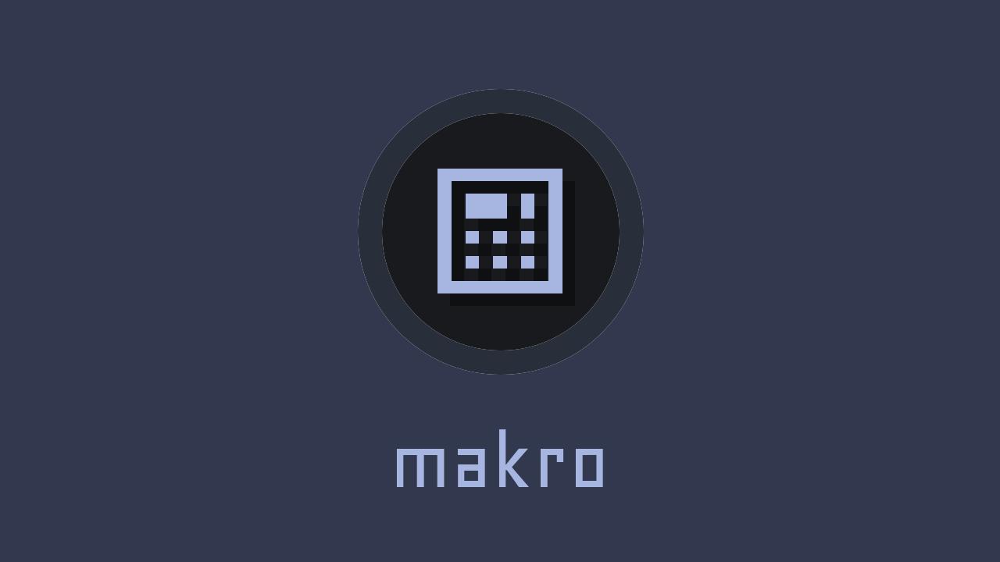

**makro** is a custom macropad build with hall effect and mechanical switch compatability in mind, allowing you to leverage analog specific features like SOCD or rapid trigger, or choose to use mechanical switches.

## 🚧 Disclaimer
### This project is currently in very early development!
I am still prototyping, so many features will be unavailable.
If you wish to support the development of this project, any [donations](https://ko-fi.com/M4M8115JLS) are welcome, or you can [submit a PR](https://github.com/meeplabsdev/makro/pulls)!

## 🔧 Features
### **Hot-Swappable Keys**
Effortlessly customize the sound and feel of your macropad by swapping out switches without soldering.

### **Mix & Match Hall Effect and Mechanical Switches**
Combine Hall Effect (HE) switches with classic mechanical switches, or use them independently, offering unparalleled flexibility in tactile and auditory feedback.

### **Rotary Encoders with Programmable Haptic Feedback**
Experience software-defined haptic feedback for a satisfying tactile feel. These encoders can be reprogrammed to perform custom functions tailored to your needs.

### **OLED Screen**
A compact display provides real-time connection status and encoder levels for enhanced usability.

### **Programmable USB Hub**
Rebind any Human Interface Device (HID) plugged into the hub, enabling advanced customization of input devices like keyboards, mice, or controllers.

### **LED Lighting**
Features per-switch gradients and diffused backlighting for a visually appealing setup that enhances your workspace aesthetics.

## 🗓️ Roadmap
* [ ] v1
  * [x] design board
    * [x] HE switches
    * [x] usb c
    * [x] stm32
  * [ ] manufacture
    * waiting on delivery

## 🔗 Links
* [v1 Schematics & PCB](https://github.com/meeplabsdev/makro/tree/main/schematic/v1/schematic)
* [v1 Design Files](https://github.com/meeplabsdev/makro/tree/main/schematic/v1/design)
* [v1 SRC](https://github.com/meeplabsdev/makro/tree/main/schematic/v1/src)

## 📝 Credits / References
* [Macrolev](https://github.com/heiso/macrolev)
* [MX Switch Design](https://preview.redd.it/5aorm27pz8nb1.png?width=2000&format=png&auto=webp&s=a257e2f60b03b2b7917f5f053f3984c4a51e53e8)
* [DIYAnalogKeeb](https://github.com/tommybee456/DIYAnalogKeeb)
* [Hackpad](https://web.archive.org/web/20250217201234mp_/https://hackpad.hackclub.com/advancedguide)
* [HID Remapper](https://github.com/jfedor2/hid-remapper/tree/master)
